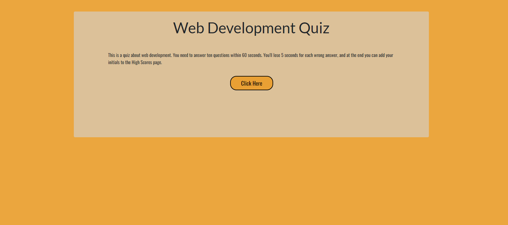
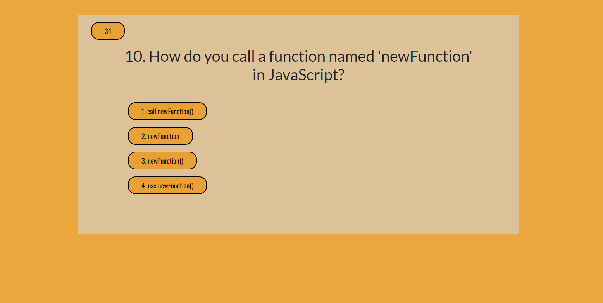
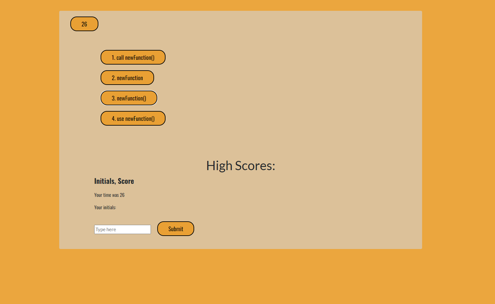

# Coding Quiz

## Description
This is a multiple-choice quiz about web development. You have 60 seconds to answer 10 questions, and each wrong answer deducts 5 seconds from your remaining time. Once the user has finished the quiz, they can save their initials and score to local storage.

## Table of Contents
- [Link](#link)
- [Screenshots](#screenshots)
- [License](#license)
- [Contact](#contact)

## Link
https://jroller33.github.io/Code-Quiz-Game/

## Screenshots

### Homepage

### Sample Question

### High Scores Page

## License
This project is licensed under the [MIT License](https://www.mit.edu/~amini/LICENSE.md).

## Contact
[GitHub](https://github.com/jroller33)

